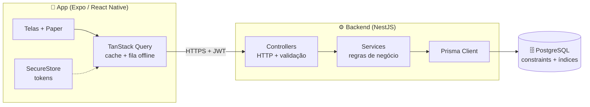
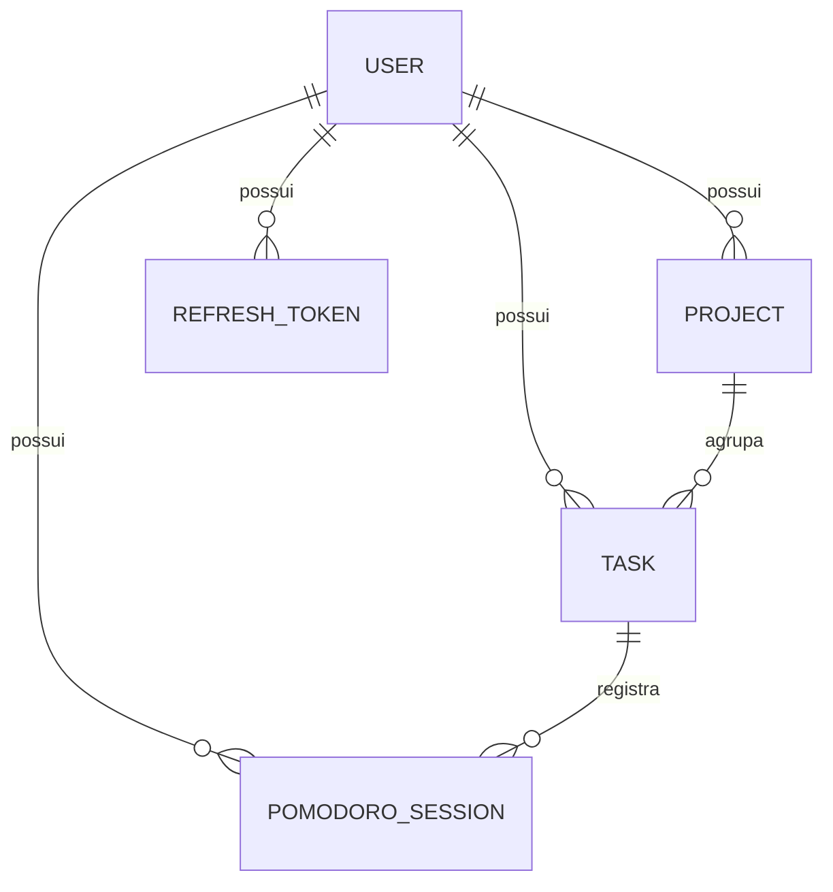
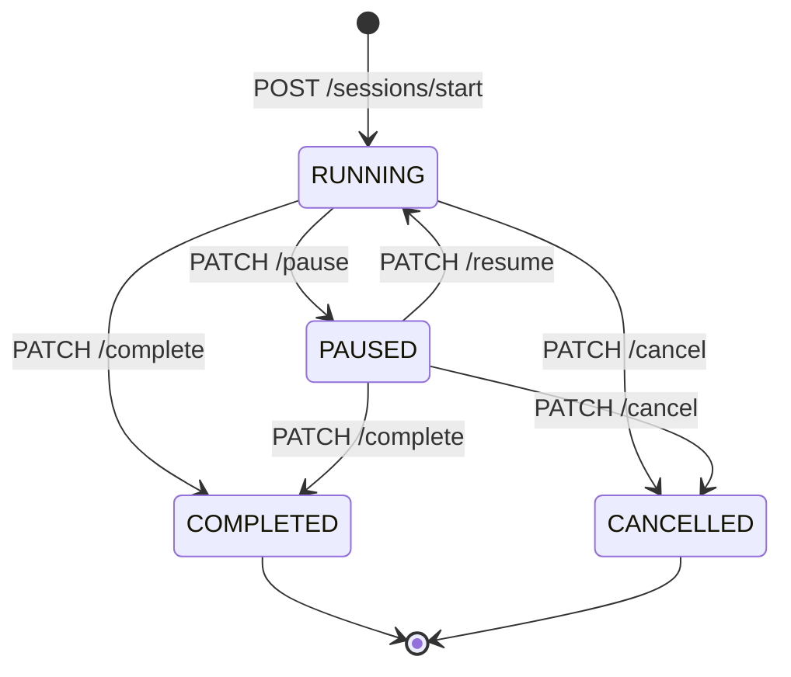

# Plano Técnico — Pomodoro App (MVP)

> Documento de planejamento do desafio técnico. Define stack, arquitetura, modelo
> de dados, contrato de API, escopo e cronograma **antes** da implementação.
> Decisões marcadas com ⚖️ são trade-offs conscientes tomados por causa do prazo.

- **Prazo:** < 3 dias
- **Data de início:** 2026-09-03
- **Entrega:** monorepo com `apps/api` (NestJS) + `apps/mobile` (Expo) + APK instalável + vídeo de demonstração

---

## 1. Objetivo

MVP de aplicativo mobile de produtividade baseado na técnica Pomodoro, com
organização de projetos e tarefas, execução de sessões de foco e visualização de
métricas — com **backend e banco de dados como fonte da verdade**.

A premissa que dirige todo o desenho:

> O aplicativo é um **cliente burro em relação às regras de negócio**. Ele
> renderiza, coleta input e deriva o tempo restante a partir de timestamps. Ele
> não decide se uma sessão pode começar, quanto tempo faltou, nem calcula
> métricas.

---

## 2. Stack escolhida

| Camada             | Tecnologia                                        | Justificativa                                                                                                                                                                                                                                                               |
| ------------------ | ------------------------------------------------- | --------------------------------------------------------------------------------------------------------------------------------------------------------------------------------------------------------------------------------------------------------------------------- |
| Mobile             | **React Native + Expo (dev client) + TypeScript** | EAS Build gera APK instalável sem exigir Android Studio no avaliador; OTA e logs facilitam a demonstração. TypeScript compartilha vocabulário de tipos com o backend.                                                                                                       |
| Navegação          | **Expo Router**                                   | Navegação baseada em arquivos, layouts aninhados e _route guards_ declarativos — o guard de autenticação vira um `_layout.tsx`, não um emaranhado de condicionais.                                                                                                          |
| Estado de servidor | **TanStack Query** + persister                    | Cache, revalidação, retry e _offline mutations_ prontos. Cobre "tratamento de perda de conexão" e "sincronização ao recuperar a conexão" sem infraestrutura própria.                                                                                                        |
| Estado local       | **Zustand**                                       | Apenas o _tick_ do timer e preferências de UI. Nenhuma regra de negócio.                                                                                                                                                                                                    |
| UI                 | **React Native Paper** (Material 3)               | Snackbar, ActivityIndicator, Dialog e Banner prontos ⇒ "estados de carregamento", "feedback visual" e "tratamento de erros" saem com pouco custo. ⚖️ Design system próprio seria mais bonito e consumiria o prazo inteiro.                                                  |
| Credenciais        | **expo-secure-store**                             | Tokens em Keychain/Keystore, não em AsyncStorage.                                                                                                                                                                                                                           |
| Backend            | **NestJS + TypeScript**                           | Módulos e injeção de dependência tornam a arquitetura em camadas explícita e auditável em code review; `class-validator` cobre validação de entrada; `@nestjs/swagger` gera a documentação da API a partir do próprio código (entregável obrigatório, sempre sincronizado). |
| ORM / Migrations   | **Prisma**                                        | Migrations versionadas e reproduzíveis (`prisma migrate`), tipagem ponta a ponta, `$transaction` para operações atômicas.                                                                                                                                                   |
| Banco              | **PostgreSQL 16**                                 | Chaves estrangeiras reais, `CHECK`, _unique index_ parcial, transações e agregações SQL para as métricas. É o banco que permite **provar no schema** a regra de sessão única — algo que um banco de documentos não expressaria.                                             |
| Infra local        | **docker-compose**                                | `docker compose up` sobe Postgres + API; requisito de "instruções para criar e executar o banco localmente" atendido em um comando.                                                                                                                                         |
| Distribuição       | **APK + `docker compose up`**                     | O enunciado pede instruções de execução e uma forma clara de avaliar, não um ambiente hospedado. O app lê o endereço da API de configuração, então o avaliador aponta o build para a própria máquina. Hospedar continua possível — a imagem é um container OCI comum.       |

### Alternativas descartadas

| Opção                                     | Por que não                                                                                                       |
| ----------------------------------------- | ----------------------------------------------------------------------------------------------------------------- |
| Firebase / Supabase como backend completo | Elimina exatamente a camada que o desafio quer avaliar (regras de negócio, autorização, transações, constraints). |
| MongoDB                                   | O enunciado cobra chaves estrangeiras, constraints e consistência relacional. Seria começar se defendendo.        |
| React Native "bare"                       | Custo de setup para o avaliador sem ganho de avaliação.                                                           |
| Fastify + Drizzle                         | Ótimo e mais leve, mas a documentação da API e a estrutura em camadas ficariam manuais — caro para o prazo.       |

---

## 3. Arquitetura



### Camadas do backend

```
apps/api/src/
├── auth/           # registro, login, refresh, guards JWT
├── users/          # perfil e preferências
├── projects/       # CRUD + arquivamento
├── tasks/          # CRUD + mudança de status
├── sessions/       # máquina de estados do Pomodoro (núcleo)
├── stats/          # agregações de histórico e métricas
├── common/         # filtros de exceção, interceptors, DTOs base
└── prisma/         # schema, migrations, seed
```

**Regra de dependência:** Controller → Service → Prisma. Nenhum controller toca
Prisma; nenhum service conhece HTTP. O `PrismaExceptionFilter` traduz erros do
banco (ex.: `23505`) em respostas HTTP semânticas — a constraint do banco vira
contrato de API.

---

## 4. Modelo de dados



### Entidades

**User** — `id`, `email` (unique), `passwordHash`, `name`, `createdAt`, `updatedAt`
e preferências: `focusDurationSec` (default 1500), `shortBreakSec` (300),
`longBreakSec` (900), `cyclesUntilLongBreak` (4).

**Project** — `id`, `userId` → User, `name`, `color`, `archivedAt?`, timestamps.

**Task** — `id`, `userId` → User, `projectId?` → Project, `title`,
`status` (`TODO | IN_PROGRESS | DONE`), `estimatedPomodoros`, `completedAt?`.

**PomodoroSession** — `id`, `userId` → User, `taskId?` → Task,
`kind` (`FOCUS | SHORT_BREAK | LONG_BREAK`),
`status` (`RUNNING | PAUSED | COMPLETED | CANCELLED`),
`startedAt`, `durationSec`, `pausedAt?`, `pausedAccumulatedMs` (default 0),
`endedAt?`, `clientMutationId?` (unique).

**RefreshToken** — `id`, `userId` → User, `tokenHash`, `expiresAt`, `revokedAt?`,
`deviceLabel?`.

### Decisões de modelagem

1. **`userId` denormalizado em `Task` e `PomodoroSession`.** Toda consulta filtra
   pelo dono sem JOIN, e a autorização vira uma cláusula `WHERE user_id = ?`
   sistemática. É a defesa mais simples e auditável contra vazamento de dados
   entre usuários — requisito explícito do enunciado. A consistência com
   `Project.userId` é garantida na escrita (o service valida a posse do projeto
   dentro da mesma transação).
2. **Sem campo de "tempo restante".** A sessão guarda quando começou, quanto deve
   durar e quanto tempo ficou pausada. O restante é sempre derivado. Isso torna
   _correto por construção_ fechar o app, reiniciar o backend, reiniciar o
   aparelho ou abrir em outro dispositivo.
3. **Deleção lógica em Project** (`archivedAt`) para não perder histórico de
   sessões vinculadas.

### Constraints, índices e integridade

```sql
-- Regra de negócio protegida pelo banco: no máximo uma sessão ativa por usuário.
CREATE UNIQUE INDEX one_active_session_per_user
    ON pomodoro_sessions (user_id)
    WHERE status IN ('RUNNING', 'PAUSED');

-- Coerência temporal
ALTER TABLE pomodoro_sessions
    ADD CONSTRAINT chk_duration_positive CHECK (duration_sec > 0),
    ADD CONSTRAINT chk_ended_after_started CHECK (ended_at IS NULL OR ended_at >= started_at),
    ADD CONSTRAINT chk_paused_non_negative CHECK (paused_accumulated_ms >= 0);

-- Consultas de histórico e métricas
CREATE INDEX idx_sessions_user_started ON pomodoro_sessions (user_id, started_at DESC);
CREATE INDEX idx_sessions_user_status  ON pomodoro_sessions (user_id, status);
CREATE INDEX idx_tasks_user_status     ON tasks (user_id, status);
CREATE INDEX idx_projects_user_active  ON projects (user_id, archived_at);
```

O índice parcial é escrito em **SQL cru dentro da migration Prisma**, porque o
schema do Prisma não expressa índices parciais. A violação retorna `23505`, que o
`PrismaExceptionFilter` converte em **409 Conflict**. Resultado: a regra "sem duas
sessões simultâneas" é validada no service **e** garantida pelo banco, mesmo sob
requisições concorrentes de dois dispositivos.

**Chaves estrangeiras:** `ON DELETE CASCADE` de User para tudo que lhe pertence;
`ON DELETE SET NULL` de Project para Task e de Task para PomodoroSession — apagar
um projeto não pode apagar o histórico de foco já realizado.

**Migrations:** versionadas em `prisma/migrations/`, aplicadas com
`prisma migrate deploy` no start do container. Seed opcional cria um usuário de
demonstração para o avaliador.

---

## 5. Máquina de estados da sessão Pomodoro



Transições inválidas retornam **409 Conflict** com o estado atual no corpo, para
o app se reconciliar em vez de insistir.

### Cálculo do tempo restante (feito no servidor e replicado no cliente)

```
decorridoMs = (agora ou pausedAt) - startedAt - pausedAccumulatedMs
restanteMs  = max(0, durationSec * 1000 - decorridoMs)
```

O endpoint `GET /sessions/active` devolve `serverTime` junto com a sessão. O app
calcula o _offset_ entre o relógio do dispositivo e o do servidor uma vez e o
aplica ao contador — assim o timer não desanda se o relógio do aparelho estiver
errado.

### Conclusão automática

Uma sessão `RUNNING` cujo prazo já expirou é finalizada **de forma preguiçosa**:
na próxima leitura (`GET /sessions/active` ou início de nova sessão), o backend
detecta o vencimento e a marca `COMPLETED` com `endedAt = startedAt + duração +
pausas`, dentro de uma transação. ⚖️ Evita introduzir um _worker_ agendado no
MVP, sem perder consistência — o resultado final é idêntico, apenas materializado
no primeiro acesso.

---

## 6. Contrato da API

Base: `/api/v1` · Autenticação: `Authorization: Bearer <access_token>` ·
Documentação viva em `/api/docs` (Swagger UI, gerado do código).

### Auth

| Método | Rota             | Descrição                                                  |
| ------ | ---------------- | ---------------------------------------------------------- |
| `POST` | `/auth/register` | Cria conta. 409 se e-mail já existe.                       |
| `POST` | `/auth/login`    | Retorna `accessToken` (15 min) + `refreshToken` (30 dias). |
| `POST` | `/auth/refresh`  | Rotaciona o refresh token; revoga o anterior.              |
| `POST` | `/auth/logout`   | Revoga o refresh token do dispositivo atual.               |

### Usuário

| Método  | Rota  | Descrição                        |
| ------- | ----- | -------------------------------- |
| `GET`   | `/me` | Perfil + preferências.           |
| `PATCH` | `/me` | Atualiza nome e durações padrão. |

### Projetos e tarefas

| Método             | Rota                      | Descrição                               |
| ------------------ | ------------------------- | --------------------------------------- |
| `GET` / `POST`     | `/projects`               | Lista (com contagem de tarefas) / cria. |
| `PATCH` / `DELETE` | `/projects/:id`           | Atualiza / arquiva.                     |
| `GET` / `POST`     | `/tasks?projectId&status` | Lista filtrada / cria.                  |
| `PATCH` / `DELETE` | `/tasks/:id`              | Atualiza (inclui status) / remove.      |

### Sessões Pomodoro

| Método  | Rota                                                        | Descrição                                                                                       |
| ------- | ----------------------------------------------------------- | ----------------------------------------------------------------------------------------------- |
| `POST`  | `/sessions/start`                                           | Body: `taskId?`, `kind`, `durationSec?`, `clientMutationId`. **409** se já houver sessão ativa. |
| `GET`   | `/sessions/active`                                          | Sessão ativa + `serverTime`. `204` se não houver.                                               |
| `PATCH` | `/sessions/:id/pause` · `/resume` · `/complete` · `/cancel` | Transições de estado.                                                                           |
| `GET`   | `/sessions?from&to&cursor&limit`                            | Histórico paginado por cursor.                                                                  |

### Métricas

| Método | Rota                        | Descrição                                                                |
| ------ | --------------------------- | ------------------------------------------------------------------------ |
| `GET`  | `/stats/summary?range=week` | Total de foco, sessões concluídas, taxa de conclusão, sequência de dias. |
| `GET`  | `/stats/daily?from&to`      | Série diária de minutos focados (gráfico).                               |
| `GET`  | `/stats/by-project?range`   | Distribuição de foco por projeto.                                        |

Todas as agregações são feitas em SQL (`GROUP BY date_trunc(...)`) — o app nunca
soma sessões para produzir estatística.

### Formato de erro (padronizado)

```json
{
  "statusCode": 409,
  "code": "SESSION_ALREADY_ACTIVE",
  "message": "Já existe uma sessão em andamento.",
  "details": { "activeSessionId": "..." }
}
```

O campo `code` é estável e é o que o app usa para decidir a UI; `message` é
apresentável ao usuário.

---

## 7. Autenticação, autorização e proteção de dados

- Senhas com **argon2id** (fallback bcrypt cost 12).
- **Access token** JWT curto (15 min) + **refresh token opaco** com hash no banco,
  rotativo. Logout revoga apenas o dispositivo atual; o login permanece válido nos
  outros — o que sustenta o requisito de multi-dispositivo.
- O app guarda tokens no `expo-secure-store` e renova de forma transparente via
  interceptor; um 401 dispara um único refresh com as requisições enfileiradas.
- **Autorização:** um guard injeta `userId` a partir do JWT e _todo_ acesso a
  recurso é escopado por ele. Recurso de outro usuário responde **404** (e não
  403), para não confirmar a existência do id.
- Rate limit (`@nestjs/throttler`) nas rotas de autenticação.
- CORS restrito, Helmet, validação com _whitelist_ — propriedades não declaradas
  no DTO são rejeitadas.

---

## 8. Comportamento offline e sincronização

| Situação                    | Comportamento                                                                                                            |
| --------------------------- | ------------------------------------------------------------------------------------------------------------------------ |
| Leitura sem rede            | Cache persistido do TanStack Query alimenta as telas; banner "Modo offline" no topo.                                     |
| Escrita sem rede            | Mutação entra na fila persistida e é reenviada ao voltar a conexão (`NetInfo` → `onlineManager`).                        |
| Reenvio duplicado           | Todo `POST /sessions/start` carrega um `clientMutationId` **UUID**; o índice único no banco torna o reenvio idempotente. |
| App reaberto                | `GET /sessions/active` reconcilia o timer; o estado local é descartado em favor do servidor.                             |
| Conflito entre dispositivos | O servidor vence, sempre. O app exibe o estado retornado e informa o usuário.                                            |

⚖️ **Escopo:** o offline cobre leitura em cache e reenvio de mutações. Não há
resolução de merge sofisticada — com o servidor como fonte única da verdade e
sessão única por usuário, o espaço de conflito é pequeno e "servidor vence" é
correto, não um atalho.

---

## 9. Telas do aplicativo

| #   | Tela                | Conteúdo                                                                                                           |
| --- | ------------------- | ------------------------------------------------------------------------------------------------------------------ |
| 1   | **Cadastro**        | Nome, e-mail, senha; validação inline; erro de e-mail duplicado.                                                   |
| 2   | **Login**           | Autenticação + persistência de sessão; splash decide a rota inicial.                                               |
| 3   | **Dashboard**       | Foco de hoje, sessões concluídas, sequência, tarefas em andamento, atalho "Iniciar foco".                          |
| 4   | **Projetos**        | Lista com cor e contagem, criar/editar/arquivar, estado vazio ilustrado.                                           |
| 5   | **Tarefas**         | Filtro por projeto e status, criação rápida, marcar como concluída.                                                |
| 6   | **Sessão Pomodoro** | Timer circular, vínculo com tarefa, pausar/retomar/concluir/cancelar, _keep awake_, notificação local ao terminar. |
| 7   | **Histórico**       | Lista paginada por dia, com tipo, duração e tarefa; filtro por período.                                            |
| 8   | **Estatísticas**    | Gráfico de barras (minutos/dia), distribuição por projeto, taxa de conclusão.                                      |
| 9   | **Perfil**          | Dados do usuário, preferências de duração, logout.                                                                 |

**Padrões transversais em todas as telas:** _skeleton_ durante carregamento,
componente `EmptyState` reutilizável, `ErrorState` com botão "Tentar novamente",
Snackbar para confirmação de ações e desabilitação de botões durante submissão.

Navegação: _tab bar_ com Dashboard · Projetos · Foco · Estatísticas · Perfil;
Tarefas e Histórico como rotas empilhadas.

---

## 10. Estratégia de testes

| Nível                      | Escopo                                                                           | Ferramenta                   |
| -------------------------- | -------------------------------------------------------------------------------- | ---------------------------- |
| Unitário (backend)         | Máquina de estados da sessão, cálculo de tempo decorrido, agregações de métricas | Jest                         |
| Integração / e2e (backend) | Fluxos críticos contra Postgres real                                             | Jest + Supertest + Docker    |
| Componente (mobile)        | `SessionTimer`, `EmptyState`, formulários                                        | React Native Testing Library |

**Casos e2e priorizados:**

1. Registro → login → refresh → acesso autorizado.
2. Usuário A não enxerga nem altera recurso do usuário B (404).
3. Iniciar segunda sessão com uma ativa ⇒ 409.
4. Duas requisições `start` concorrentes ⇒ exatamente uma sessão criada (prova o índice parcial).
5. Sessão vencida é materializada como `COMPLETED` na leitura seguinte.
6. Transição inválida (`resume` em sessão `COMPLETED`) ⇒ 409.

⚖️ **Fora do escopo pelo prazo:** E2E de UI (Maestro/Detox) e testes de carga.
A justificativa e o plano de evolução ficam registrados no README — cobertura é
concentrada onde uma falha seria silenciosa e cara (regras de sessão e
isolamento entre usuários), não distribuída uniformemente.

---

## 11. Cronograma

### Dia 1 — Backend e banco

- [ ] Monorepo, `docker-compose.yml` (Postgres + API), variáveis de ambiente
- [ ] Schema Prisma + migration inicial + migration SQL do índice parcial e CHECKs
- [ ] Módulo de auth (registro, login, refresh rotativo, guards)
- [ ] CRUD de projetos e tarefas com escopo por usuário
- [ ] Módulo de sessões: máquina de estados + transações + conclusão preguiçosa
- [ ] Módulo de métricas (SQL agregado)
- [ ] Swagger, filtro global de exceções, seed
- [ ] Testes e2e prioritários (casos 1–4)
- [ ] Imagem de produção com migrations aplicadas no boot

### Dia 2 — Aplicativo: núcleo

- [ ] Projeto Expo, Expo Router, tema Paper, cliente HTTP com interceptor de refresh
- [ ] Auth persistida (SecureStore) + splash + _route guards_
- [ ] Telas de Cadastro e Login
- [ ] Projetos e Tarefas (listar, criar, editar, arquivar/concluir)
- [ ] **Tela de Sessão Pomodoro** — reconciliação com `GET /sessions/active`, timer derivado, controles, notificação local

### Dia 3 — Aplicativo: complemento e entrega

- [ ] Dashboard, Histórico (paginado), Estatísticas (gráficos), Perfil
- [ ] Estados de carregamento/vazio/erro, banner offline, fila de mutações
- [ ] Testes de componente
- [ ] README completo (instalação, execução, banco, API, arquitetura, decisões)
- [ ] Build APK via EAS + vídeo curto de demonstração
- [ ] Revisão final contra o checklist do enunciado

---

## 12. Riscos e mitigações

| Risco                                                   | Mitigação                                                                                                                                        |
| ------------------------------------------------------- | ------------------------------------------------------------------------------------------------------------------------------------------------ |
| Build EAS falhar ou demorar perto do prazo              | Disparar um build de teste ainda no Dia 1, com o app mínimo.                                                                                     |
| Timer divergir entre servidor e app                     | `serverTime` no payload + cálculo de _offset_; nunca contar a partir do relógio local isolado.                                                   |
| Escopo das 9 telas estourar o prazo                     | Backend inteiro pronto no Dia 1; telas construídas por ordem de peso na avaliação (Pomodoro > Projetos/Tarefas > Estatísticas).                  |
| Avaliador sem conseguir alcançar a API pelo dispositivo | Endereço da API configurável no app, `network security config` para HTTP em rede local desde o bootstrap, e vídeo de demonstração como garantia. |

---

## 13. Entregáveis (checklist do enunciado)

- [ ] Código-fonte do app mobile — `apps/mobile`
- [ ] Código-fonte do backend — `apps/api`
- [ ] Migrations do banco — `apps/api/prisma/migrations`
- [ ] README com instalação, execução do app, execução do backend e criação do banco
- [ ] Documentação da API — Swagger em `/api/docs` + resumo no README
- [ ] Estratégia de testes — seção do README (resumo da seção 10)
- [ ] Explicação da arquitetura — seção do README (resumo das seções 3–5)
- [ ] Justificativa das tecnologias — seção do README (resumo da seção 2)
- [ ] Forma de avaliar: **APK** + `docker compose up` + vídeo de demonstração
